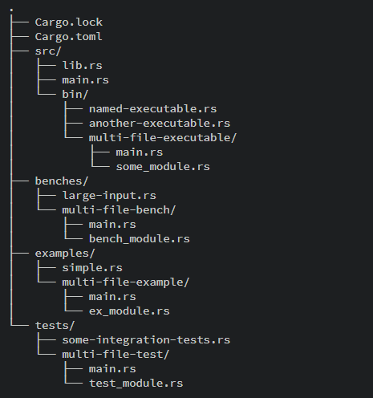

# 모듈 (module)

`impl`블록은 해당 타입의 함수들에 대한 네임스페이스를 제공합니다.

마찬가지로, `mod`는 타입과 함수들에 대해 네임스페이스를 제공합니다:

```rust
mod foo {
    pub fn do_something() {
        println!("In the foo module");
    }
}

mod bar {
    pub fn do_something() {
        println!("In the bar module");
    }
}

fn main() {
    foo::do_something();
    bar::do_something();
}
```

모듈은 블록처럼 이름의 범위를 결정하고 C/C++이나 다른 언어의 namespace처럼 사용 가능합니다. 모듈을 지정하고 파일로 만들어 별도의 파일에 모듈을 정의할 수 있습니다.&#x20;

러스트의 프로젝트 구조화는 Cargo.toml에 해당하는 패키지, 각 패키지의 빌드 단위인 바이너리와 라이브러리 크레이트(crate), 모듈로 구성됩니다.&#x20;

<figure><figcaption><p>패키지 구조의 예시</p></figcaption></figure>

[카고의 패키지 문서](https://doc.rust-lang.org/cargo/guide/project-layout.html)를 보면 자세한 설명이 있습니다.&#x20;


