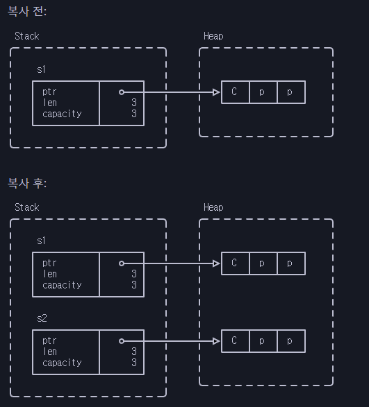

# Modern C++에서 이중해제 문제

Modern C++은 이 문제를 다르게 해결합니다:

```c++
std::string s1 = "Cpp";
std::string s2 = s1;  // Duplicate the data in s1.
```

* s1의 힙 데이터는 복제되고, s2는 독립적인 복사본을 얻습니다.
* s1 와 s2의 스코프가 종료되면 각각의 메모리가 해제됩니다.

<figure><figcaption></figcaption></figure>

<details>

<summary>연습</summary>

* 복사하지 않으려면 move를 해야 합니다. C++에서 어떻게 하면 되나요?

</details>
