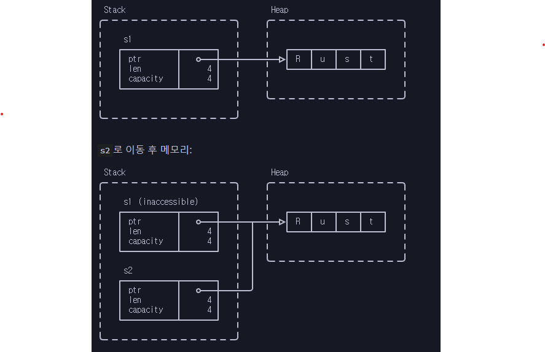

# 문자열 이동

```rust
fn main() {
    let s1: String = String::from("Rust");
    let s2: String = s1;
}
```

* s1의 힙 데이터는 s2에서 재사용 됩니다.
* s1의 스코프가 종료되면 아무일도 일어나지 않습니다.(이미 이동되었습니다.)

<figure><figcaption></figcaption></figure>

<details>

<summary>놀미 노트</summary>

* 이동은 스택 변수만 대상입니다. 스택 변수가 힙에 대한 포인터를 갖고 있습니다. 따라서, 이동은 포인터 값을 포함한 스택 변수의 내용만 이동합니다.
* s2를 통해 힙 포인터를 따라가서 힙 메모리도 해제됩니다. 이는 Drop에서 이루어지고 String이 사용하는 Vec의 Drop 기능입니다.
* 소유권 추적은 컴파일러의 기능입니다. 러스트 컴파일러는 GC와 유사한 변수의 사용과 참조 관리 기능을 갖고 있습니다.

</details>
